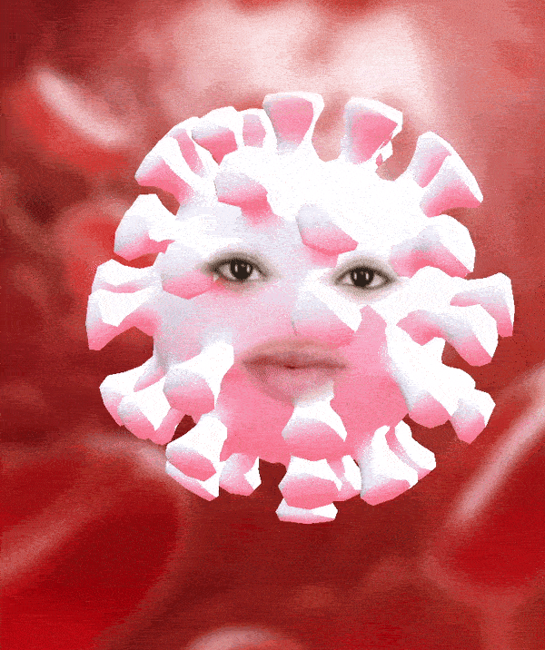

# COVID-19-Awareness-Snap-Lens

Made for Snapchat India's First Lensathon (2020). This augmented reality lens aims to promote social awareness about SARS-CoV-2 using the concept of reverse psychology.

